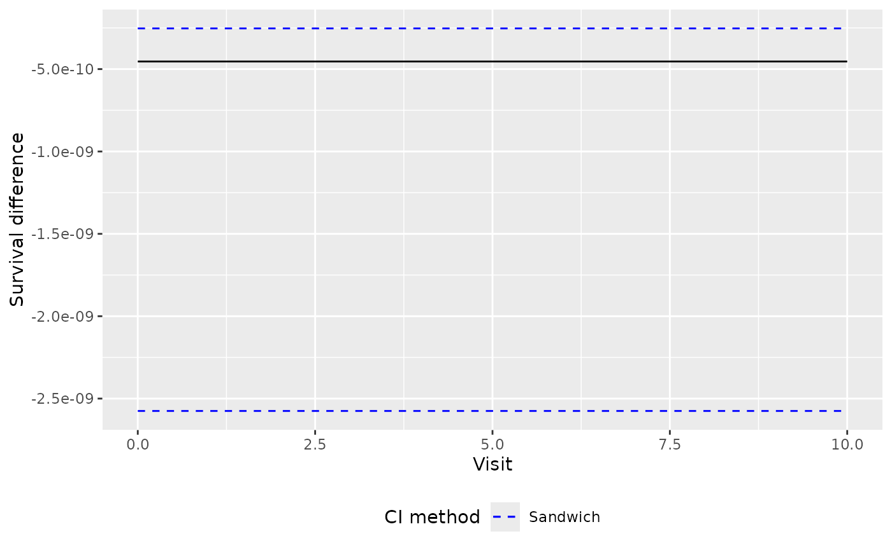
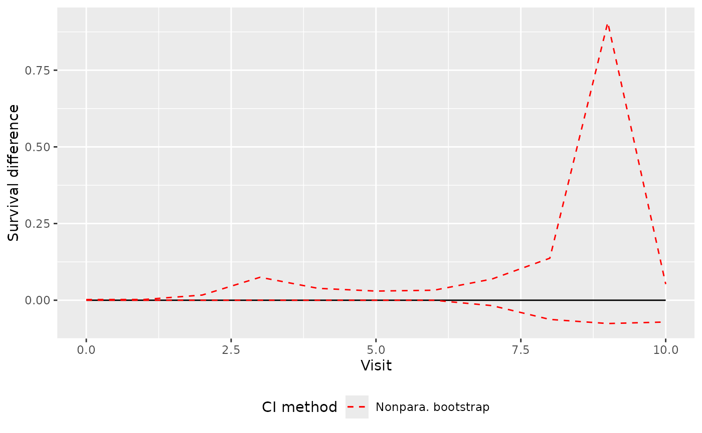
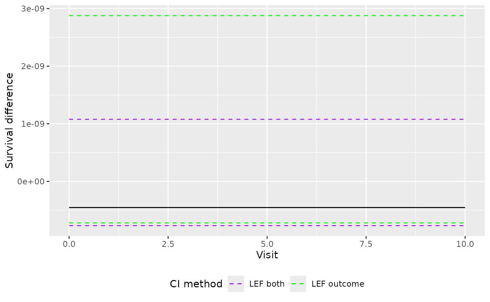
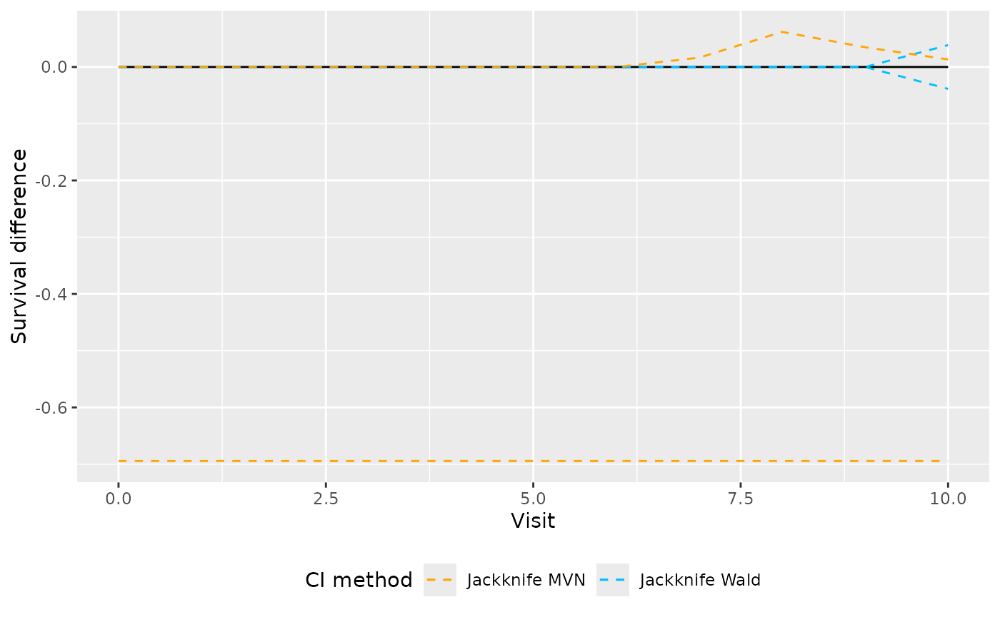

# Confidence Interval Methods

``` r

library(TrialEmulation)
```

## Confidence Interval Methods

This vignette demonstrates the confidence interval methods available for
per-protocol effect estimation and inference.

Confidence intervals are obtained through the
[`predict()`](https://causal-lda.github.io/TrialEmulation/reference/predict_marginal.md)
method for fitted `trial_sequence` objects. The confidence interval
method is controlled through the `ci_type` argument.

Currently available methods are:

- `"sandwich"`
- `"Nonpara. bootstrap"`
- `"LEF outcome"`
- `"LEF both"`
- `"Jackknife Wald"`
- `"Jackknife MVN"`

The default method uses the sandwich variance estimator. Alternative
methods based on bootstrap and jackknife resampling can be useful in
settings with smaller sample sizes, sparse outcomes, or low treatment
prevalence \[1\].

## Example Analysis

We begin by fitting a simple per-protocol target trial emulation.

### Create a Trial Sequence Object

``` r

trial_pp <- trial_sequence(estimand = "PP")

trial_pp_dir <- file.path(tempdir(), "trial_pp")
dir.create(trial_pp_dir)

data("data_censored")

trial_pp <- trial_pp |>
  set_data(
    data = data_censored,
    id = "id",
    period = "period",
    treatment = "treatment",
    outcome = "outcome",
    eligible = "eligible"
  ) |>
  set_switch_weight_model(
    numerator = ~age,
    denominator = ~ age + x1 + x3,
    model_fitter = stats_glm_logit(
      save_path = file.path(trial_pp_dir, "switch_models")
    )
  ) |>
  set_censor_weight_model(
    censor_event = "censored",
    numerator = ~x2,
    denominator = ~ x2 + x1,
    pool_models = "none",
    model_fitter = stats_glm_logit(
      save_path = file.path(trial_pp_dir, "censor_models")
    )
  ) |>
  calculate_weights() |>
  set_outcome_model() |>
  set_expansion_options(
    output = save_to_datatable(),
    chunk_size = 500
  ) |>
  expand_trials() |>
  load_expanded_data() |>
  fit_msm()
```

## Sandwich Confidence Intervals

The sandwich variance estimator is the default confidence interval
method. It uses the robust variance-covariance matrix estimate of the
marginal structural model parameters together with multivariate Normal
sampling.

``` r

pred_sandwich <- predict(
  trial_pp,
  newdata = outcome_data(trial_pp)[trial_period == 1, ],
  predict_times = 0:10,
  type = "survival",
  conf_int = TRUE,
  ci_type = "sandwich"
)

head(pred_sandwich$difference)
#>   followup_time survival_diff          2.5%         97.5%
#> 1             0 -4.538847e-10 -2.575032e-09 -2.530313e-10
#> 2             1 -4.538847e-10 -2.575032e-09 -2.530313e-10
#> 3             2 -4.538847e-10 -2.575032e-09 -2.530313e-10
#> 4             3 -4.538847e-10 -2.575032e-09 -2.530313e-10
#> 5             4 -4.538847e-10 -2.575032e-09 -2.530313e-10
#> 6             5 -4.538847e-10 -2.575032e-09 -2.530313e-10
```

This is the fastest confidence interval method and is often suitable for
larger datasets.

``` r

library(ggplot2)

ggplot(as.data.frame(pred_sandwich$difference), aes(x = as.data.frame(pred_sandwich$difference)$followup_time, y = as.data.frame(pred_sandwich$difference)$survival_diff)) +
  geom_line() +
  geom_line(aes(y = as.data.frame(pred_sandwich$difference)[, 3], color = "Sandwich"), linetype = "dashed") +
  geom_line(aes(y = as.data.frame(pred_sandwich$difference)[, 4], color = "Sandwich"), linetype = "dashed") +
  labs(
    y = "Survival difference",
    x = "Visit"
  ) +
  scale_color_manual(name = "CI method", values = c(
    "Nonpara. bootstrap" = "red", "Sandwich" = "blue",
    "LEF outcome" = "green", "LEF both" = "purple",
    "Jackknife MVN" = "orange", "Jackknife Wald" = "deepskyblue"
  )) +
  theme(
    plot.background = element_rect(fill = "transparent", color = NA),
    legend.position = "bottom",
    legend.background = element_rect(fill = "transparent")
  )
```



## Nonparametric Bootstrap

The nonparametric bootstrap repeatedly resamples patients and refits the
complete analysis in each bootstrap sample.

``` r

pred_boot <- predict(
  trial_pp,
  newdata = outcome_data(trial_pp)[trial_period == 1, ],
  predict_times = 0:10,
  type = "survival",
  conf_int = TRUE,
  ci_type = "Nonpara. bootstrap",
  samples = 100
)

head(pred_boot)
#>   followup_time survival_diff   lower_bound upper_bound
#> 1             0 -4.538847e-10 -9.163525e-10 0.002251194
#> 2             1 -4.538847e-10 -9.173719e-10 0.002487813
#> 3             2 -4.538847e-10 -9.177756e-10 0.016871943
#> 4             3 -4.538847e-10 -4.062513e-09 0.074880789
#> 5             4 -4.538847e-10 -4.133242e-05 0.038780439
#> 6             5 -4.538847e-10 -1.292145e-05 0.029875652
```

The `samples` argument specifies the number of bootstrap resamples.

``` r

ggplot(as.data.frame(pred_boot), aes(x = as.data.frame(pred_boot)$followup_time, y = as.data.frame(pred_boot)$survival_diff)) +
  geom_line() +
  geom_line(aes(y = as.data.frame(pred_boot)[, 3], color = "Nonpara. bootstrap"), linetype = "dashed") +
  geom_line(aes(y = as.data.frame(pred_boot)[, 4], color = "Nonpara. bootstrap"), linetype = "dashed") +
  labs(
    y = "Survival difference",
    x = "Visit"
  ) +
  scale_color_manual(name = "CI method", values = c(
    "Nonpara. bootstrap" = "red", "Sandwich" = "blue",
    "LEF outcome" = "green", "LEF both" = "purple",
    "Jackknife MVN" = "orange", "Jackknife Wald" = "deepskyblue"
  )) +
  theme(
    plot.background = element_rect(fill = "transparent", color = NA),
    legend.position = "bottom",
    legend.background = element_rect(fill = "transparent")
  )
```



## LEF Bootstrap Methods

The linearised estimating function (LEF) bootstrap methods provide
computationally efficient alternatives to the ordinary bootstrap.

### LEF Outcome

The `"LEF outcome"` method uses a linear approximation for the marginal
structural model parameters while refitting the weight models within
each bootstrap sample.

``` r

pred_lef_outcome <- predict(
  trial_pp,
  newdata = outcome_data(trial_pp)[trial_period == 1, ],
  predict_times = 0:10,
  type = "survival",
  conf_int = TRUE,
  ci_type = "LEF outcome",
  samples = 100
)

head(pred_lef_outcome)
#>   followup_time survival_diff   lower_bound  upper_bound
#> 1             0 -4.538847e-10 -7.207579e-10 2.878264e-09
#> 2             1 -4.538847e-10 -7.207579e-10 2.878264e-09
#> 3             2 -4.538847e-10 -7.207579e-10 2.878264e-09
#> 4             3 -4.538847e-10 -7.207579e-10 2.878264e-09
#> 5             4 -4.538847e-10 -7.207579e-10 2.878264e-09
#> 6             5 -4.538847e-10 -7.207579e-10 2.878264e-09
```

### LEF Both

The `"LEF both"` method uses linear approximations for both the weight
model parameters and the marginal structural model model parameters.

``` r

pred_lef_both <- predict(
  trial_pp,
  newdata = outcome_data(trial_pp)[trial_period == 1, ],
  predict_times = 0:10,
  type = "survival",
  conf_int = TRUE,
  ci_type = "LEF both",
  samples = 100
)

head(pred_lef_both)
#>   followup_time survival_diff   lower_bound  upper_bound
#> 1             0 -4.538847e-10 -7.683553e-10 1.078012e-09
#> 2             1 -4.538847e-10 -7.683553e-10 1.078012e-09
#> 3             2 -4.538847e-10 -7.683553e-10 1.078012e-09
#> 4             3 -4.538847e-10 -7.683553e-10 1.078012e-09
#> 5             4 -4.538847e-10 -7.683553e-10 1.078012e-09
#> 6             5 -4.538847e-10 -7.683553e-10 1.078012e-09
```

Because repeated model fitting is avoided, this method is often
substantially faster than the ordinary nonparametric bootstrap.

``` r

ggplot(as.data.frame(pred_lef_outcome), aes(x = as.data.frame(pred_lef_outcome)$followup_time, y = as.data.frame(pred_lef_outcome)$survival_diff)) +
  geom_line() +
  geom_line(aes(y = as.data.frame(pred_lef_outcome)[, 3], color = "LEF outcome"), linetype = "dashed") +
  geom_line(aes(y = as.data.frame(pred_lef_outcome)[, 4], color = "LEF outcome"), linetype = "dashed") +
  geom_line(aes(y = as.data.frame(pred_lef_both)[, 3], color = "LEF both"), linetype = "dashed") +
  geom_line(aes(y = as.data.frame(pred_lef_both)[, 4], color = "LEF both"), linetype = "dashed") +
  labs(
    y = "Survival difference",
    x = "Visit"
  ) +
  scale_color_manual(name = "CI method", values = c(
    "Nonpara. bootstrap" = "red", "Sandwich" = "blue",
    "LEF outcome" = "green", "LEF both" = "purple",
    "Jackknife MVN" = "orange", "Jackknife Wald" = "deepskyblue"
  )) +
  theme(
    plot.background = element_rect(fill = "transparent", color = NA),
    legend.position = "bottom",
    legend.background = element_rect(fill = "transparent")
  )
```



## Jackknife Methods

The package also provides two jackknife-based confidence interval
methods.

### Jackknife Wald

The Wald jackknife method estimates the standard error of the cumulative
risk/survival difference using leave-one-patient-out resampling and
constructs a Normal approximation confidence interval.

``` r

pred_jack_wald <- predict(
  trial_pp,
  newdata = outcome_data(trial_pp)[trial_period == 1, ],
  predict_times = 0:10,
  type = "survival",
  ci_type = "Jackknife Wald"
)

head(pred_jack_wald)
#>   followup_time survival_diff   lower_bound  upper_bound
#> 1             0 -4.538847e-10 -2.176518e-09 1.268749e-09
#> 2             1 -4.538847e-10 -2.176518e-09 1.268749e-09
#> 3             2 -4.538847e-10 -2.176518e-09 1.268749e-09
#> 4             3 -4.538847e-10 -2.176518e-09 1.268749e-09
#> 5             4 -4.538847e-10 -2.176518e-09 1.268749e-09
#> 6             5 -4.538847e-10 -2.176518e-09 1.268749e-09
```

### Jackknife MVN

The multivariate Normal jackknife method estimates a jackknife
variance-covariance matrix for the outcome model parameters and uses
multivariate Normal sampling, much like the sandwich variance-based
confidence interval method.

``` r

pred_jack_mvn <- predict(
  trial_pp,
  newdata = outcome_data(trial_pp)[trial_period == 1, ],
  predict_times = 0:10,
  type = "survival",
  conf_int = TRUE,
  ci_type = "Jackknife MVN"
)

head(pred_jack_mvn$difference)
#>   followup_time survival_diff       2.5% 97.5%
#> 1             0 -4.538847e-10 -0.6944656     0
#> 2             1 -4.538847e-10 -0.6944656     0
#> 3             2 -4.538847e-10 -0.6944656     0
#> 4             3 -4.538847e-10 -0.6944656     0
#> 5             4 -4.538847e-10 -0.6944656     0
#> 6             5 -4.538847e-10 -0.6944656     0
```

``` r

ggplot(as.data.frame(pred_jack_wald), aes(x = as.data.frame(pred_jack_wald)$followup_time, y = as.data.frame(pred_jack_wald)$survival_diff)) +
  geom_line() +
  geom_line(aes(y = as.data.frame(pred_jack_wald)[, 3], color = "Jackknife Wald"), linetype = "dashed") +
  geom_line(aes(y = as.data.frame(pred_jack_wald)[, 4], color = "Jackknife Wald"), linetype = "dashed") +
  geom_line(aes(y = as.data.frame(pred_jack_mvn$difference)[, 3], color = "Jackknife MVN"), linetype = "dashed") +
  geom_line(aes(y = as.data.frame(pred_jack_mvn$difference)[, 4], color = "Jackknife MVN"), linetype = "dashed") +
  labs(
    y = "Survival difference",
    x = "Visit"
  ) +
  scale_color_manual(name = "CI method", values = c(
    "Nonpara. bootstrap" = "red", "Sandwich" = "blue",
    "LEF outcome" = "green", "LEF both" = "purple",
    "Jackknife MVN" = "orange", "Jackknife Wald" = "deepskyblue"
  )) +
  theme(
    plot.background = element_rect(fill = "transparent", color = NA),
    legend.position = "bottom",
    legend.background = element_rect(fill = "transparent")
  )
```



The choice of confidence interval method depends on the size and
characteristics of the dataset \[1\].

| Scenario | Recommended CI Method | Reason |
|----|----|----|
| Small/medium sample size, low/medium event rate, low/medium treatment prevalence | LEF Bootstrap CI | Most reliable overall performance in sparse data settings. |
| Large sample size and medium/high event rate | Sandwich CI | Good performance with lowest computational cost. |
| Small sample size and low treatment prevalence | Jackknife Wald CI | Maintained close-to-nominal coverage. |
| Small sample size, medium/high event rate, and low/medium treatment prevalence | Jackknife MVN CI | Maintained close-to-nominal coverage. |

The LEF methods were developed to improve confidence interval
performance in settings where sandwich-based intervals may exhibit
undercoverage, while avoiding the computational burden of a full
nonparametric bootstrap. The latter method can also be unstable in
settings with small sample size and very low outcome event rates, where
some bootstrap samples may result in non-invertible covariate matrices.
In such cases, the lack of refitting in the LEF methods are beneficial.
More discussion is given in the reference below \[1\].

## Additional Notes

- Resampling-based confidence intervals are currently available only for
  per-protocol estimands.
- The sandwich estimator remains the default confidence interval method.
- For bootstrap-based methods, the `samples` argument specifies the
  number of resamples. For `"sandwich"` and `"Jackknife MVN"` methods,
  the `samples` argument determines the sample size of the mutivariate
  Normal sampling.
- Larger values of `samples` improve Monte Carlo precision but increase
  computation time.
- Confidence intervals are calculated pointwise at each prediction time.
- If a user requests a jackknife-based CI with more than 1000 patients,
  a warning is issued because the number of leave-one-out jackknife
  replicates equals the number of patients, which can substantially
  increase computation time when the sample size is large.

## Reference

\[1\] Limozin, J.M., Seaman, S.R. and Su, L., 2025. Inference procedures
in sequential trial emulation with survival outcomes: Comparing
confidence intervals based on the sandwich variance estimator, bootstrap
and jackknife. Statistical Methods in Medical Research, 34(10),
pp.2011-2033.
