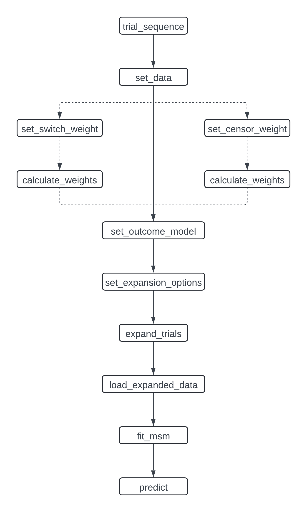

```{r, include = FALSE}
knitr::opts_chunk$set(
  collapse = TRUE,
  comment = "#>"
)
```

```{r setup}
library(TrialEmulation)
```

To improve usability, we have implemented a new user interface. This allows a more structured specification of the 
target trial emulation process.

It also gives flexibility to add new methods and tools for parts of the analysis. For example, we now allow different
ways of storing the expanded data: as CSV files and in a DuckDB database. We also allow different weight fitting model
procedures: using `stats::glm` or `parglm::parglm`. New components can quickly and easily be specified for use with
this package.


## User Interface

A sequence of target trials analysis starts by specifying which estimand will be used:

```{r}
trial_pp <- trial_sequence(estimand = "PP") # Per-protocol
trial_itt <- trial_sequence(estimand = "ITT") # Intention-to-treat
```

Additionally it is useful to create a directory to save files for later inspection.
```{r}
trial_pp_dir <- file.path(tempdir(), "trial_pp")
dir.create(trial_pp_dir)
trial_itt_dir <- file.path(tempdir(), "trial_itt")
dir.create(trial_itt_dir)
```


### Observational Data

Next the user must specify the observational input data that will be used to for the target trial emulation.
Here we need to specify which columns contain which values and how they should be used.
```{r}
data("data_censored")
trial_pp <- trial_pp |>
  set_data(
    data = data_censored,
    id = "id",
    period = "period",
    treatment = "treatment",
    outcome = "outcome",
    eligible = "eligible"
  )

# Function style without pipes
trial_itt <- set_data(
  trial_itt,
  data = data_censored,
  id = "id",
  period = "period",
  treatment = "treatment",
  outcome = "outcome",
  eligible = "eligible"
)
```

We can inspect our object by printing:

```{r}
trial_itt
```

We see the newly attached data. Some pre-processing has occurred: the id, period, treatment, outcome and eligible
columns are renamed to have those names, and some additional columns required for later processing have been created.
We also see some hints that other components of the analysis are not yet defined.

### Weight Models

To adjust for the effects of informative censoring, inverse probability of censoring weights (IPCW) can be applied. To
estimate these weights, we construct time-to-(censoring-)event models. Two sets of models are fit for the two censoring mechanisms which
may apply: censoring due to deviation from assigned treatment and other informative censoring.

#### Censoring due to treatment switching

We specify model formulas to be used for calculating the probability of receiving treatment in the current period.
Separate models are fitted for patients who had `treatment = 1` and those who had `treatment = 0` in the previous 
period. Stabilized weights are used by fitting numerator and denominator models.

There are optional arguments to specify columns which can include/exclude observations from the treatment models. These
are used in case it is not possible for a patient to deviate from a certain treatment assignment in that period.

```{r}
trial_pp <- trial_pp |>
  set_switch_weight_model(
    numerator = ~age,
    denominator = ~ age + x1 + x3,
    model_fitter = stats_glm_logit(save_path = file.path(trial_pp_dir, "switch_models"))
  )
trial_pp@switch_weights
```

This type of censoring is not used with an ITT estimand, so we cannot use `set_switch_weight_model()` with `trial_ITT`
objects.
Note that we calculated stabilised weights, so a numerator and denominator model is required. The numerator should
contain terms that are not time varying. These terms are later included in the final time-to-event model for the
outcome.

#### Other informative censoring

In case there is other informative censoring occurring in the data, we can create similar models to estimate the IPCW.
These can be used with all types of estimand. 
Compared to `set_switch_weight_model` there are additional required arguments:

 - `censor_event` which specifies the column containing the censoring indicator
 - `pool_models` which species that models may be fit separately (as in `set_switch_weight_model`) or pooled across the
treatments in the previous period. The choices are `"none"`, `"both"`, or `"numerator"` only. The default and allowed
choices depends on the estimand.


```{r}
trial_pp <- trial_pp |>
  set_censor_weight_model(
    censor_event = "censored",
    numerator = ~x2,
    denominator = ~ x2 + x1,
    pool_models = "none",
    model_fitter = stats_glm_logit(save_path = file.path(trial_pp_dir, "switch_models"))
  )
trial_pp@censor_weights
```

```{r}
trial_itt <- set_censor_weight_model(
  trial_itt,
  censor_event = "censored",
  numerator = ~x2,
  denominator = ~ x2 + x1,
  pool_models = "numerator",
  model_fitter = stats_glm_logit(save_path = file.path(trial_itt_dir, "switch_models"))
)
trial_itt@censor_weights
```

#### Calculate Weights

Next we need to fit the individual models and combine them into weights. This is done with `calculate_weights()`.

```{r}
trial_pp <- trial_pp |> calculate_weights()
trial_itt <- calculate_weights(trial_itt)
```

The full model objects are saved to disk in the directories we created above. The summaries are stored in the trial
sequence object and can be printed:

```{r}
show_weight_models(trial_itt)
```

### Specify Outcome Model

Now we can specify the outcome model. Here we can include adjustment terms for any variables in the dataset.
We can also specify how `followup_time` and `trial_period` terms should be included in the model.
As for the weight models, we can specify a `model_fitter`. The numerator terms from the stabilised weight
models are automatically included in the outcome model formula.

```{r}
trial_pp <- set_outcome_model(trial_pp)
trial_itt <- set_outcome_model(trial_itt, adjustment_terms = ~x2)
```

It is necessary to specify the outcome model at this stage because we need to know which columns should be
retained and expanded in the construction of the sequence of trials data set. After expansion it is possible
to set the outcome model again to modify how covariates are modelled, e.g. to add an interaction or squared
term. To add a term for a variable not in the expanded data, the expansion procedure will need to be repeated.
 

### Expand Trials

Now we are ready to create the data set with all of the sequence of target trials. First we specify some options for the
expansion and then expand.

#### Set Expansion Options

There are two options to set

 - output: specifies how and where the expanded data will be saved. As it can be very large, we may need to save it to
 disk with CSV files or DuckDB, using a `save_to_*` function.
 - chunk_size: if the expanded data is too large to fit in memory, we need to process it in chunks by specifying how
 many patients are processed at one time.

```{r}
trial_pp <- set_expansion_options(
  trial_pp,
  output = save_to_datatable(),
  chunk_size = 500
)
trial_itt <- set_expansion_options(
  trial_itt,
  output = save_to_datatable(),
  chunk_size = 500
)
```

Other options for big data are to save to csv or DuckDB:

```{r, eval = FALSE}
trial_pp <- trial_pp |>
  set_expansion_options(
    output = save_to_csv(file.path(trial_pp_dir, "trial_csvs")),
    chunk_size = 500
  )

trial_itt <- set_expansion_options(
  trial_itt,
  output = save_to_csv(file.path(trial_itt_dir, "trial_csvs")),
  chunk_size = 500
)

trial_itt <- set_expansion_options(
  trial_itt,
  output = save_to_duckdb(file.path(trial_itt_dir, "trial_duckdb")),
  chunk_size = 500
)

# For the purposes of this vignette the previous `save_to_datatable()` output
# option is used in the following code.
```


#### Create Sequence of Trials Data

Now we are ready to construct the sequence of trials dataset using the `expand()` method.
This can take some time for large input data.

```{r}
trial_pp <- expand_trials(trial_pp)
trial_itt <- expand_trials(trial_itt)
```

The resulting object shows the settings used for the expansion and where the expanded data has been 
saved.

```{r}
trial_pp@expansion
```


### Sample or Load from Expanded Data

Now that the expanded data has been created, we can prepare the data to fit the outcome model.
For data that can fit comfortably in memory, this is a trivial step using `load_expanded_data`.
For large datasets, it may be necessary to sample from the expanded by setting the `p_control` argument. This
sets the probability that an observation with`outcome == 0` will be included in the loaded data. A seed can be set for
reproducibility.
Additionally, a vector of periods to can be specified to include, eg `period = 1:60`, and/or a subsetting condition,
`subset_condition = "age > 65"`.


```{r}
trial_itt <- load_expanded_data(trial_itt, seed = 1234, p_control = 0.5)
```

The loaded data can be accessed and or modified with `outcome_data()`.
```{r}
x2_sq <- outcome_data(trial_itt)$x2^2
outcome_data(trial_itt)$x2_sq <- x2_sq
head(outcome_data(trial_itt))
```


### Fit Marginal Structural Model

To fit the outcome model we use `fit_msm()`. There are two options to specify how weights are used in the model.
First we can select which weights columns are used, by default the product of columns `weight` and `sample_weight` is
used. We can also apply a modifier function, for example, to trim large weights to some fixed value or a percentile.


```{r}
trial_itt <- fit_msm(
  trial_itt,
  weight_cols = c("weight", "sample_weight"),
  modify_weights = function(w) {
    q99 <- quantile(w, probs = 0.99)
    pmin(w, q99)
  }
)
```

The summary of the model fit is shown:

```{r}
trial_itt@outcome_model
```

Depending on the model fitter used, we can also access the model object.
For the default `stats::glm` logistic model, we have the `glm` object as well as the `sandwich` variance-covariance
matrix.
```{r}
trial_itt@outcome_model@fitted@model$model
trial_itt@outcome_model@fitted@model$vcov
```

The complete object shows all the specifications:
```{r}
trial_itt
```


### Inference

We use the `predict()` method to estimate survival probabilities or cumulative incidences for different values of
`assigned_treatment`. The `predict` method takes the baseline of the provided `newdata`, i.e. observations with 
`followup_time == 0` and constructs data with `followup_time` for the given `predict_times`.
It is important to specify `newdata` correctly for a meaningful interpretation of the differences in survival.

```{r}
preds <- predict(
  trial_itt,
  newdata = outcome_data(trial_itt)[trial_period == 1, ],
  predict_times = 0:10,
  type = "survival",
)
plot(preds$difference$followup_time, preds$difference$survival_diff,
  type = "l", xlab = "Follow up", ylab = "Survival difference"
)
lines(preds$difference$followup_time, preds$difference$`2.5%`, type = "l", col = "red", lty = 2)
lines(preds$difference$followup_time, preds$difference$`97.5%`, type = "l", col = "red", lty = 2)
```

### Flowchart

This flow chart helps visualise the complete workflow.

{ width=80% }
